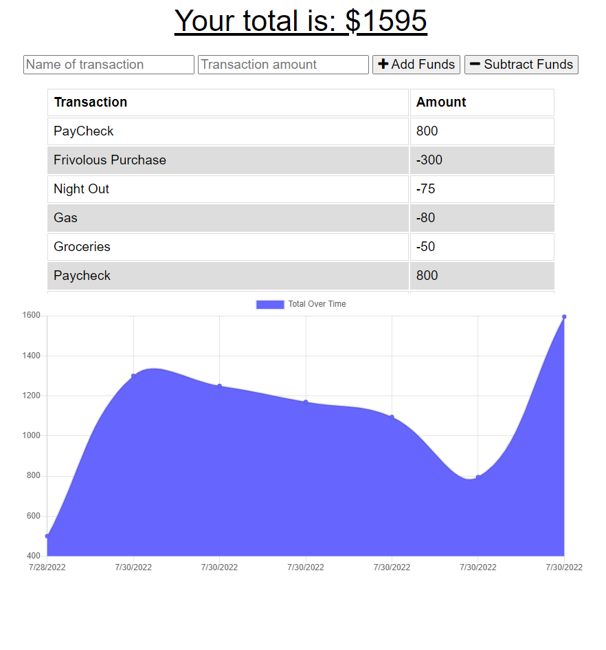

# PWA-Budget-Tracker
  
  ## Description
  Budget Tracker is a progressive web application that can be downloaded to a local device and used with or without internet. The user can track their income and expenditures with this app. 
  
  ## Table of Contents
  1. [Installation Instructions](#installation-instructions)
  2. [Usage Information](#usage-information)
  3. [Contribution Guidelines](#contribution-guidelines)
  4. [Screenshot](#screenshot)
  5. [Questions](#questions)
  
  ## Installation Instructions
  To install clone the repository and open in vs code. This application requires node.js, express, and mongoose. After cloning the repository run npm install to install the dependencies. Finally type npm start in the terminal and check it out at localhost:3001

  ## Usage Information
  This app is deployed to heroku via mongoDB which allows the user to access it by going to [this link](https://jordan-thomas-budget-tracker.herokuapp.com/).

  ## Contribution Guidelines
  Jordan Thomas is the main contributor to this application. There are no extra contributions necessary, but feel free to adjust your clone of it for your specific needs. 

  ## Screenshot
  

  ## Questions
  Please reach out with any further questions.

  [GitHub](https://github.com/Jordanio49)

  [Email](mailto:Jthomas135@hotmail.com)